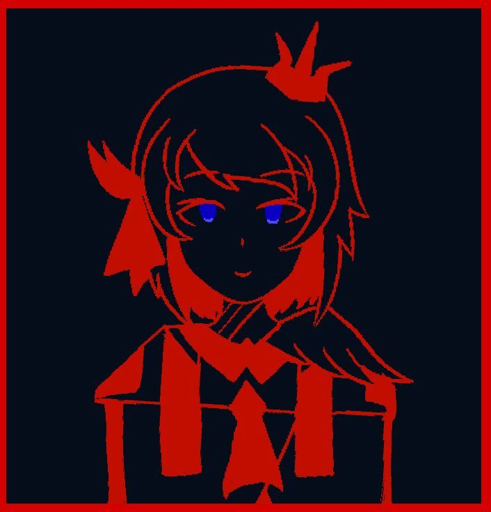

# 人物

> **剧透范围：** 本条目包含《时幻书:零》的核心诡计。

## 简介

- [《时幻书：零》](../../novels/fantame-zero/)与《时幻书》的主人公，作为无依无靠的孤儿被收养

## 基本信息

  

    

      <!-- =========================
           卡片正面
           ========================= -->
      <section
        class="character-card-face character-card-front"
        aria-label="角色基本资料"
        aria-hidden="false"
      >

        <button
          type="button"
          class="character-card-bookmark"
          data-card-toggle
          aria-expanded="false"
          aria-label="查看里侧"
        >
          档案
        </button>

        <header class="character-card-header">

          

            
              书库记录
            

            

              人物档案
            

          

          
            No. 001
          

        </header>

        

          

            
          

          

            <dl class="character-card-list">

              

                <dt>姓名</dt>
                <dd>亚歇尔-泽里克亚契</dd>
              

              

                <dt>别名</dt>
                <dd>启示者方舟</dd>
              

              

                <dt>生日</dt>
                <dd>圣座纪1000年土月13日</dd>
              

              

                <dt>所属组织</dt>
                <dd>
                  <a href="../../organizations/team-fantame/">
                    探险队“时幻”
                  </a>
                </dd>
              

              

                <dt>道路位阶</dt>
                <dd>
                承位 咒术使
                </dd>
              

              

                <dt>资格</dt>
                <dd>救世主</dd>
              

            </dl>

          

        

      </section>

      <!-- =========================
           卡片背面
           ========================= -->
      <section
        class="character-card-face character-card-back"
        aria-label="另一种可能性"
        aria-hidden="true"
      >

        <button
          type="button"
          class="character-card-bookmark"
          data-card-toggle
          aria-expanded="false"
          aria-label="返回正史"
        >
          返回
        </button>

        <header class="character-card-header">

          

            
              异常记录
            

            

              异常资料
            

          

          
            No. 001
          

        </header>
       

       

    
  

        

        

            <h3>姓名</h3>
            

              茵提尔-涅恩斯
            

          

          

            <h3>生日</h3>
            

              圣座纪1000年风月13日
            

          

          

            <h3>所属组织</h3>
            

              谋世之匣
            

          

          

            <h3>道路位阶</h3>
            

              王座 调令者
            

          

          

            <h3>资格</h3>
            

              “救世主”
            

          

        

    

## 人际关系
- **养姐**：[菲莉卡-泽里克亚契](../../characters/ferica/)
- **母亲**：西涅尔-涅恩斯
- **祖先**：艾克莉娅-“残刃”-涅恩斯
## 外貌
有着红色眼睛的棕发少女。
## 性格
随路线变化。

## 经历
### 《时幻书：零》第一卷

作为尤城孤儿院最优秀的孩子被选中，被尤城的贵族泽里克亚契家族收养。

## 相关地点

- [尤卡耶尔](../../locations/yokayel/)

## 相关事件

待补充。

## 资料出处

- 第一卷第一章

[返回人物索引](../)
